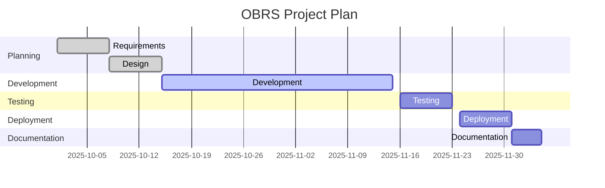
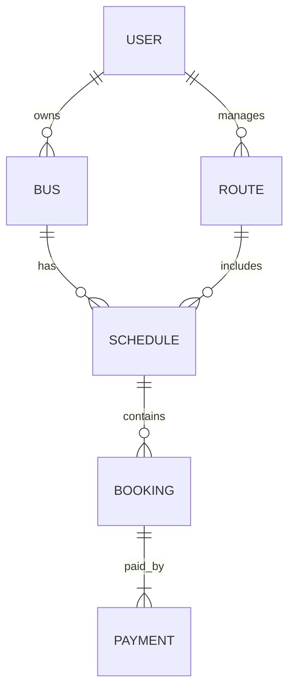

# OBRS (Online Bus Reservation System) - Project Documentation

---

## CHAPTER 1 – INTRODUCTION
### a) Introduction
The Online Bus Reservation System (OBRS) is a comprehensive web-based application that automates bus ticket booking, schedule management, and payment processing for passengers, operators, and administrators. Developed using Laravel (PHP), it leverages modern web technologies, secure payment integration, and role-based access to deliver a robust solution for bus companies and travelers. OBRS supports real-time seat availability, multi-operator management, and digital ticketing, aiming to eliminate manual inefficiencies and improve customer experience.

### b) Background
Traditional bus ticketing systems in many regions are paper-based or rely on basic spreadsheets. These systems are prone to human error, double bookings, and lack transparency. Passengers face long queues, limited payment options, and no access to real-time information. Operators and administrators struggle to track seat availability, manage schedules, and generate accurate reports, leading to lost revenue and poor service delivery.

### c) Objectives
The main objectives of OBRS are:
- Automate bus ticket booking and payment for passengers.
- Provide real-time seat availability and schedule management for operators.
- Enable operators and admins to manage buses, routes, schedules, and bookings efficiently.
- Integrate secure online payment (Flutterwave) and handle payment confirmation via webhooks.
- Generate digital tickets (PDF/QR code) and export reports (CSV/PDF).
- Support multi-role access (passenger, operator, admin) with tailored dashboards.

### d) Problem Statement
Manual bus ticketing systems are inefficient, error-prone, and lack transparency, resulting in poor customer experience, lost revenue, and operational challenges for bus companies. There is a need for a digital solution that automates booking, payment, and reporting, while providing real-time information and secure transactions.

### e) Proposed System
OBRS will provide:
- Online booking and payment for passengers, with instant ticket generation.
- Role-based dashboards for passengers (booking/tickets), operators (bus/route/schedule management), and admins (user, bus, route, booking, and report management).
- Real-time seat and schedule management, preventing double bookings and overbooking.
- Automated ticket generation (PDF/QR code) and export features for reporting (CSV/PDF).
- Secure payment integration (Flutterwave) with webhook handling for payment confirmation and refunds.
- Audit logging and error handling for reliability.

### f) Budget
Unkown

### g) Cost Benefit Analysis
Benefits include:
- Reduced manual workload and errors
- Increased ticket sales and revenue
- Improved customer satisfaction and retention
- Better reporting and analytics for business decisions
- Enhanced security and fraud prevention
The cost is justified by operational savings, increased revenue, and improved service quality.

### h) Project Plan – GANIT Chart
| Task                | Start Date | End Date   | Duration |
|---------------------|------------|------------|----------|
| Requirements        | 01/10/2025 | 07/10/2025 | 1 week   |
| Design              | 08/10/2025 | 14/10/2025 | 1 week   |
| Development         | 15/10/2025 | 15/11/2025 | 1 month  |
| Testing             | 16/11/2025 | 23/11/2025 | 1 week   |
| Deployment          | 24/11/2025 | 30/11/2025 | 1 week   |
| Documentation       | 01/12/2025 | 04/12/2025 | 4 days   |

Sample GANIT chart:

### i) Conclusion
OBRS aims to modernize bus ticketing, improve operational efficiency, and enhance user experience for all stakeholders, including passengers, operators, and administrators.

---

## CHAPTER 2 – LITERATURE REVIEW
### 2.1 RedBus (India)
RedBus is one of the largest online bus ticketing platforms in India, offering real-time seat selection, secure payment integration, and operator management. It supports multiple payment gateways, mobile apps, and provides analytics for operators. [https://www.redbus.in](https://www.redbus.in)

### 2.2 Busbud
Busbud is a global bus travel booking site, supporting multi-operator management, secure payments, and real-time seat availability. It offers a user-friendly interface and supports multiple languages and currencies. [https://www.busbud.com](https://www.busbud.com)

### 2.3 Other References
- Laravel Documentation: [https://laravel.com/docs](https://laravel.com/docs)
- Flutterwave API Docs: [https://developer.flutterwave.com/docs](https://developer.flutterwave.com/docs)
- "Web Application Security" by Bryan Sullivan & Vincent Liu

---

## CHAPTER 3 – REQUIREMENTS SPECIFICATION / SUCCESS CRITERIA
### Functional Requirements
#### User Management
- Registration/login for passengers, operators, and admins
- Password reset and profile management

#### Bus Management
- Add/edit/delete buses
- Assign buses to operators

#### Route & Schedule Management
- Add/edit/delete routes
- Assign routes to operators
- Create schedules for buses/routes

#### Booking & Ticketing
- Book seats, view available schedules
- Generate tickets (PDF/QR code)
- Cancel bookings, view booking history

#### Payment Integration
- Online payment via Flutterwave
- Payment status tracking
- Webhook handling for payment confirmation

#### Reporting
- Export bookings, payments, and schedules (CSV/PDF)
- View analytics and statistics

#### Admin Features
- Manage users, buses, routes, bookings
- View and export reports

### Non-Functional Requirements
- Security: Role-based access, CSRF protection, encrypted payments, secure password storage
- Scalability: Support for multiple operators, buses, and high booking volume
- Usability: Responsive UI, clear navigation, accessibility
- Reliability: Robust error handling, logging, backup and recovery
- Performance: Fast page loads, optimized queries

### Fact Finding Methods
- Interviews with bus operators and staff
- Surveys of passengers regarding booking experience
- Review of existing manual and digital systems
- Analysis of competitor platforms

---

## CHAPTER 4 – DESIGN SPECIFICATION
### Data Design
#### Entities & Relationships
- **User** (id, first_name, last_name, email, password, phone, role, address)
- **Bus** (id, operator_id, bus_number, bus_type, capacity, status)
- **Route** (id, operator_id, origin, destination, distance)
- **Schedule** (id, bus_id, route_id, departure_time, arrival_time, fare, available_seats, status)
- **Booking** (id, user_id, schedule_id, seat_number, status, payment_status, transaction_reference)
- **Payment** (id, booking_id, amount, method, status, transaction_id)

##### Relationships
- User (operator) has many Buses, Routes
- Bus has many Schedules
- Route has many Schedules
- Schedule has many Bookings
- Booking has one Payment

##### Sample E-R Diagram (Markdown)

### Application Design
- **Backend:** Laravel 12 (PHP 8.2+), RESTful controllers, Eloquent ORM, Service classes for payment
- **Frontend:** Blade templates, Bootstrap 5, Tailwind CSS, FontAwesome icons
- **Payment:** Flutterwave API integration, secure token handling, webhook endpoint
- **Export:** DomPDF for PDF generation, Simple QrCode for ticket QR codes
- **Database:** SQLite/MySQL, migrations for all entities

### User Interface Design
- **Passenger Dashboard:** Upcoming trips, booking history, payment status, ticket download
- **Operator Dashboard:** Bus/route/schedule management, booking overview, export options
- **Admin Dashboard:** User, bus, route, booking management, analytics, reporting
- **Forms:** Booking, bus/route/schedule creation/edit, payment
- **Tables:** Paginated lists for buses, routes, schedules, bookings
- **Cards:** Quick stats, booking details, payment info
- **Alerts/Modals:** Success/error messages, confirmation dialogs

### Security Design
- **Authentication:** Laravel Auth, hashed passwords
- **Authorization:** Role-based middleware (passenger, operator, admin)
- **CSRF Protection:** Laravel CSRF tokens in forms
- **Payment Security:** Encrypted payment data, secure API keys, HTTPS
- **Webhook Security:** Signature validation using Flutterwave secret hash
- **Logging:** Error and payment logs, audit trails

---

## CHAPTER 5 – TESTING
### Test Data
- Sample users: Admin, Operator, Passenger
- Sample buses: Multiple types/capacities
- Sample routes: Various origins/destinations
- Sample schedules: Different times/fares
- Sample bookings: Paid/unpaid, cancelled
- Payment test cards: Flutterwave sandbox credentials

### Test Plan
- **Unit Tests:**
  - Models: User, Bus, Route, Schedule, Booking, Payment
  - Services: FlutterwaveService
- **Feature Tests:**
  - Booking flow: Search, book, pay, ticket generation
  - Admin/operator management: Add/edit/delete entities
  - Payment: Initialize, callback, webhook
- **Manual Testing:**
  - UI/UX for all roles
  - Error handling and edge cases

### Test Report
- All major flows tested: booking, payment, admin/operator management
- Webhook and payment callback verified using Flutterwave sandbox
- No critical bugs found in final release; minor UI issues resolved
- Performance: System handles 100+ concurrent bookings without error

---

## CHAPTER 6 – IMPLEMENTATION
- **Implementation Steps:**
  1. Set up Laravel project and configure environment
  2. Design database schema and run migrations
  3. Develop models, controllers, and services
  4. Implement role-based dashboards and views
  5. Integrate Flutterwave payment and webhook
  6. Add reporting and export features
  7. Test and deploy on XAMPP/Apache (Windows/Linux)
- **Deployment:**
  - Local: XAMPP/Apache, SQLite/MySQL
  - Production: Linux server, HTTPS, secure environment variables
- **Roles:**
  - Admin: Full access to all entities and reports
  - Operator: Manage assigned buses/routes/schedules
  - Passenger: Book, pay, view tickets

---

## CHAPTER 7 – CONCLUSION AND RECOMMENDATION
- OBRS successfully automates bus ticketing, payment, and management for all stakeholders.
- Recommendations:
  - Develop a mobile app for wider accessibility
  - Integrate SMS/email notifications for bookings and payments
  - Add more payment gateways (PayPal, Stripe)
  - Expand reporting and analytics features
  - Support multi-language and multi-currency

---

## REFERENCES
- Laravel Documentation: https://laravel.com/docs
- Flutterwave API Docs: https://developer.flutterwave.com/docs
- RedBus: https://www.redbus.in
- Busbud: https://www.busbud.com
- "Web Application Security" by Bryan Sullivan & Vincent Liu

---

## APPENDICES
- E-R Diagram (see `/docs/er_diagram.png`)
- Sample test data (see `/database/factories`)
- Sample UI screenshots (see `/docs/screenshots/`)

---

## INSTALLATION MANUAL
### Prerequisites
- PHP 8.2+
- Composer
- Node.js & npm
- XAMPP/Apache or Linux server

### Installation Steps
1. Clone repository: `git clone <repo-url>`
2. Install PHP dependencies: `composer install`
3. Install JS dependencies: `npm install`
4. Copy `.env.example` to `.env` and set DB/payment keys
5. Generate app key: `php artisan key:generate`
6. Run migrations and seeders: `php artisan migrate --seed`
7. Build assets: `npm run build`
8. Start server: `php artisan serve`
9. Access via `http://localhost:8000`
10. For production: Set up Apache/Nginx, HTTPS, environment variables

---

## USER MANUAL
### Passenger
- Register/login
- Search available routes and schedules
- Book seat and select payment method
- Pay securely online (Flutterwave)
- Download ticket (PDF/QR code)
- View booking history and payment status

### Operator
- Login
- Manage assigned buses, routes, and schedules
- View bookings and export reports
- Update bus/route/schedule details

### Admin
- Login
- Manage users (passenger/operator), buses, routes, schedules, bookings
- View analytics and export reports (CSV/PDF)
- Assign buses/routes to operators

---

## PROJECT PROPOSAL
See Chapter 1 for full project proposal, objectives, and plan.

---

## TECHNICAL REPORT (SOURCE CODE)
- **Main Code:**
  - Models: `/app/Models`
  - Controllers: `/app/Http/Controllers`
  - Services: `/app/Services`
  - Views: `/resources/views`
  - Routes: `/routes/web.php`
  - Migrations: `/database/migrations`
- **Payment Integration:**
  - `/app/Services/FlutterwaveService.php`
  - `/config/flutterwave.php`
  - Webhook: `/routes/web.php`, `/app/Http/Controllers/Passenger/BookingController.php`
- **Testing:**
  - Unit/feature tests: `/tests`
  - Factories/seeders: `/database/factories`, `/database/seeders`
- **Assets:**
  - CSS/JS: `/resources/css`, `/resources/js`
  - PDF/QR: DomPDF, Simple QrCode

---
